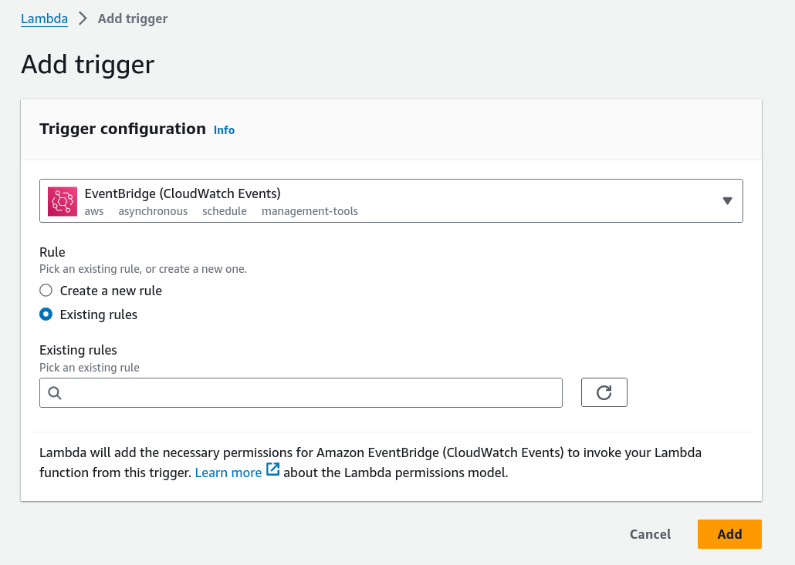

## Lambda Auto Deployer

The project delivers an AWS Lambda that is triggered on ECR Push events from AWS EventBridge. This aims to simplify the rollout process of AWS lambdas in deployment environments.

## Configurations

### IAM Roles

This lambda requires permssions to `update-function-code` for other lambdas. Thus, besides basic execution role generated for the lambda, it requires additional policy that allows `lambda:UpdateFunctionCode`, for example:

```json
{
    "Version": "2012-10-17",
    "Statement": [
        {
            "Sid": "VisualEditor0",
            "Effect": "Allow",
            "Action": "lambda:UpdateFunctionCode",
            "Resource": "*"
        }
    ]
}
```

### Environment variables

- `LAMBDA_NAMES`: A comma-separated list of targeted lambda names. For examples, `LAMBDA_NAMES=my-lambda,lambda-1`.
- `LAMBDA_IMAGE_REPOS`: A comma-separated list of lambda image repositories. The order must match that of `LAMBDA_NAMES`, where each repository will correspond to each lambda name in the same list position. For examples, `LAMBDA_IMAGE_REPOS=my-lambda-repo,lambda-1-repo`.
- `LAMBDA_IMAGE_TAGS`: A comma-separated list of lambda image tags that the should trigger the new deployment of the targeted lambdas. For examples, `LAMBDA_IMAGE_TAGS=0.1.0-dev,dev,0.1.0-snapshot`.

### AWS Amazon EventBridge

On an event bus, for example, `default`, create an event rule that has a pattern, matching ECR Image Action events. For example:

```json
{
  "source": ["aws.ecr"],
  "detail-type": ["ECR Image Action"],
  "detail": {
    "action-type": ["PUSH"],
    "result": ["SUCCESS"],
    "repository-name": ["my-lambda", "another-lambda"]
  }
}
```

Then, set the event rule's target to the handling lambda (i.e. this auto deployer lambda).


### Trigger

Add a lambda trigger configurations to listen to EventBridge (CloudWatch Events) and select the above event rule:



